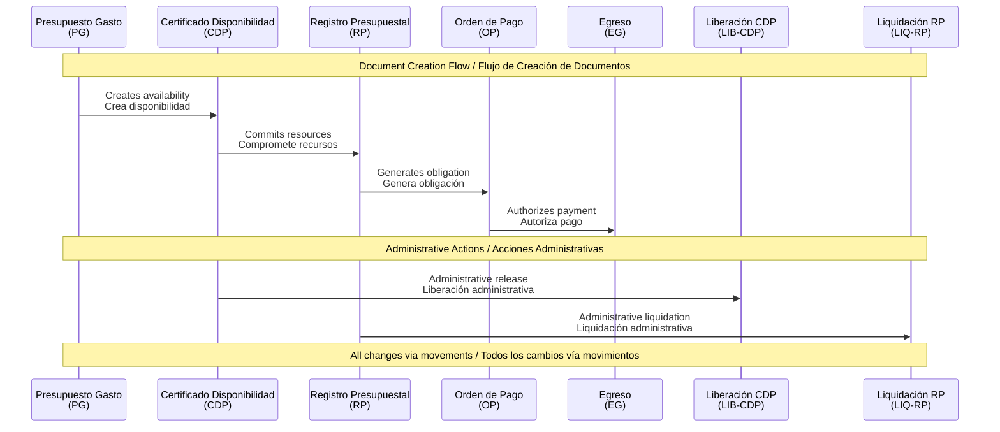
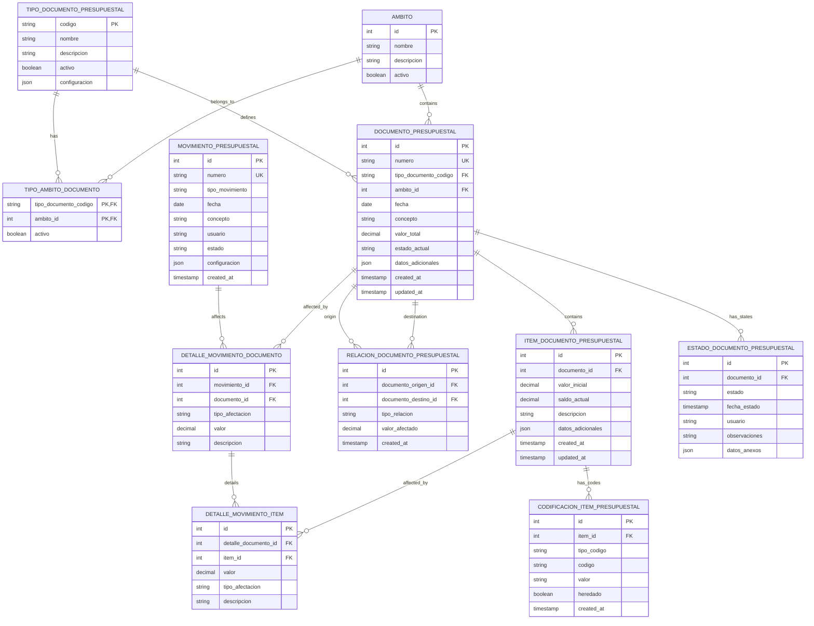

# Budget Module Architecture Diagram / Diagrama de Arquitectura del Módulo de Presupuesto

## System Architecture Overview / Descripción General de la Arquitectura

```mermaid
graph TB
    %% Main Entities / Entidades Principales
    subgraph "Configuration / Configuración"
        TDP[TIPO_DOCUMENTO_PRESUPUESTAL<br/>Budget Document Type]
        CTDP[CONFIG_CODIGO_TIPO_DOC_PRES<br/>Code Config per Document Type]
        AMB[AMBITO<br/>Realm/Scope]
        TAD[TIPO_AMBITO_DOCUMENTO<br/>Realm-Document Type Association]
        PED[PREREQUISITO_ESTADO_DOCUMENTO<br/>State Prerequisites]
    end

    subgraph "Documents / Documentos"
        DP[DOCUMENTO_PRESUPUESTAL<br/>Budget Document]
        IDP[ITEM_DOCUMENTO_PRESUPUESTAL<br/>Document Item]
        CIP[CODIFICACION_ITEM_PRESUPUESTAL<br/>Item Coding]
        RDP[RELACION_DOCUMENTO_PRESUPUESTAL<br/>Document Relations]
    end

    subgraph "Movements / Movimientos"
        MP[MOVIMIENTO_PRESUPUESTAL<br/>Budget Movement]
        DMD[DETALLE_MOVIMIENTO_DOCUMENTO<br/>Movement Document Detail]
        DMI[DETALLE_MOVIMIENTO_ITEM<br/>Movement Item Detail]
    end

    subgraph "State Management / Gestión de Estados"
        EDP[ESTADO_DOCUMENTO_PRESUPUESTAL<br/>Document State]
        TFED[TRANSICION_FLUJO_ESTADO_DOC<br/>State Flow Transition]
        ANED[ANEXO_ESTADO_DOCUMENTO<br/>State Annexes]
    end

    %% Relationships / Relaciones
    TDP -.-> TAD
    AMB -.-> TAD
    TAD --> DP
    TDP --> DP
    AMB --> DP
    TDP --> CTDP
    DP --> IDP
    IDP --> CIP
    DP --> RDP
    DP --> DMD
    IDP --> DMI
    MP --> DMD
    MP --> DMI
    DP --> EDP
    TDP --> TFED
    EDP --> TFED
    TDP --> PED
    EDP --> PED
    EDP --> ANED
    DP --> ANED

    %% External Modules / Módulos Externos
    subgraph "External / Externo"
        CONFIG[Configuration Module<br/>Módulo de Configuración]
        AUDIT[Audit Module<br/>Módulo de Auditoría]
        AUTH[Authentication Module<br/>Módulo de Autenticación]
    end

    CIP -.-> CONFIG
    MP -.-> AUDIT
    DP -.-> AUTH

    %% Styling / Estilos
    classDef configClass fill:#e1f5fe
    classDef documentClass fill:#f3e5f5
    classDef movementClass fill:#e8f5e8
    classDef stateClass fill:#fff3e0
    classDef externalClass fill:#ffebee

    class TDP,CTDP,AMB,TAD,PED configClass
    class DP,IDP,CIP,RDP documentClass
    class MP,DMD,DMI movementClass
    class EDP,TFED,ANED stateClass
    class CONFIG,AUDIT,AUTH externalClass
```

## Core Principles / Principios Fundamentales

### 1. Movement-Driven Architecture / Arquitectura Basada en Movimientos
- All value changes occur through movements / Todos los cambios de valor ocurren a través de movimientos
- No direct editing of balances / No edición directa de saldos
- Complete audit trail / Rastro de auditoría completo

### 2. State-Controlled Workflow / Flujo Controlado por Estados
- Strict state transitions / Transiciones estrictas de estados
- Prerequisite validation / Validación de prerequisitos
- JavaScript-based conditions / Condiciones basadas en JavaScript

### 3. Realm-Based Organization / Organización por Ámbitos
- Multi-realm support / Soporte multi-ámbito
- Independent numbering / Numeración independiente
- Access control per realm / Control de acceso por ámbito

### 4. Code Inheritance System / Sistema de Herencia de Códigos
- Automatic inheritance from precedents / Herencia automática desde precedentes
- Configurable requirements / Requisitos configurables
- Validation and enforcement / Validación y cumplimiento

## Document Flow Example / Ejemplo de Flujo de Documentos

## Data Layer Architecture / Arquitectura de Capa de Datos

### Tables and Relationships / Tablas y Relaciones

## Movement Types and Effects / Tipos de Movimientos y Efectos

### Movement Configuration / Configuración de Movimientos

| Movement Type | Spanish | Effect | Counterpart |
|---------------|---------|--------|-------------|
| CREAR_DOCUMENTO | Crear Documento | Creates initial values | None |
| AFECTAR_POSITIVO | Afectar Positivo | Increases balance | AFECTAR_NEGATIVO |
| AFECTAR_NEGATIVO | Afectar Negativo | Decreases balance | AFECTAR_POSITIVO |
| RESTAURAR | Restaurar | Restores previous balance | None |
| ANULAR | Anular | Cancels document | RESTAURAR |

### Document Type Flow / Flujo de Tipos de Documento

| Document | Creates | Affects | Restores To |
|----------|---------|---------|-------------|
| PG | Initial appropriation | - | - |
| CDP | Availability | PG (negative) | PG on release |
| RP | Commitment | CDP (negative) | CDP on liquidation |
| OP | Obligation | RP (negative) | RP on payment |
| EG | Payment | OP (negative) | - |

## Key Features Summary / Resumen de Características Clave

### ✅ Implemented Features / Características Implementadas

1. **Movement-Only Value Changes** / Solo cambios de valor por movimientos
2. **State-Controlled Workflows** / Flujos controlados por estados
3. **Realm-Based Organization** / Organización por ámbitos
4. **Code Inheritance System** / Sistema de herencia de códigos
5. **Prerequisite Validation** / Validación de prerequisitos
6. **Many-to-Many Document Relations** / Relaciones muchos-a-muchos entre documentos
7. **Automatic Counterpart Generation** / Generación automática de contrapartidas
8. **Complete Audit Trail** / Rastro de auditoría completo

### 🔄 In Development / En Desarrollo

1. **Real-time Balance Calculation** / Cálculo de saldos en tiempo real
2. **Advanced Reporting** / Reportes avanzados
3. **Integration APIs** / APIs de integración
4. **Performance Optimization** / Optimización de rendimiento

### 📋 Future Enhancements / Mejoras Futuras

1. **Machine Learning for Predictions** / Aprendizaje automático para predicciones
2. **Advanced Analytics Dashboard** / Tablero de análisis avanzado
3. **Multi-currency Support** / Soporte multi-moneda
4. **Enhanced Security Features** / Características de seguridad mejoradas
