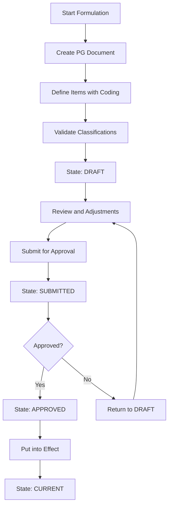
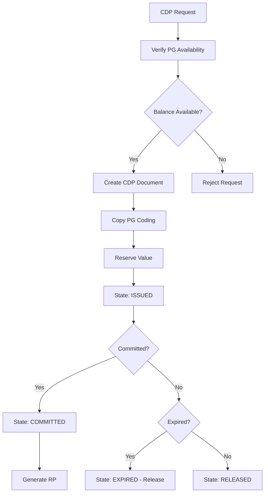
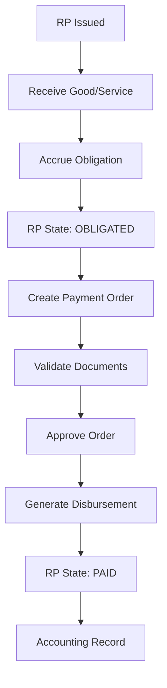

# Budget Module Documentation

## Overview

The Budget Module is the central core of the SIIAFE system, responsible for managing the entire budget lifecycle of Colombian governmental entities. This module handles everything from initial budget formulation to execution and control of public resources, ensuring compliance with Colombian regulations and transparency in public fund management.

The system is designed around the concept of **Budget Documents** and **Movements**, which represent the dynamics of budget flow in public entities.

## Fundamental Concepts

### Budget Documents
Budget documents are the central instruments that represent different states and operations within the budget cycle. Each document has a specific purpose and follows a defined flow according to Colombian regulations.

### Budget Movements
Movements are transactions that affect budget documents, allowing modification of their available values through increases, reductions, transfers, and other authorized operations.

### Document Items
Each budget document is broken down into items that represent specific classifications of expenditure or income, where each item must be coded according to the code types configured in the system.

## Types of Budget Documents

### 1. Expenditure Budget
**Purpose**: Main document that establishes annual budget appropriations for each expenditure item.

**Characteristics**:
- Base document from which all others derive
- Establishes maximum spending ceilings per item
- Approved through administrative act (Decree, Agreement, etc.)
- Can be modified through additions, reductions, and transfers

**Typical Flow**:
```
Formulation → Presentation → Approval → Execution → Control
```

### 2. Budget Availability Certificate (CDP)
**Purpose**: Document that certifies the existence of available budget appropriation to commit resources.

**Characteristics**:
- Prerequisite for initiating contracting processes
- Reserves resources from the expenditure budget
- Has defined temporal validity
- Can be released if not executed

**Typical Flow**:
```
Request → Availability Verification → Issuance → Commitment/Release
```

### 3. Budget Registration (RP)
**Purpose**: Document that formalizes the commitment of budget resources for a specific obligation.

**Characteristics**:
- Generated after awarding a contract or authorizing an expenditure
- Definitively commits resources
- Basis for generating payment orders
- Requires prior CDP

**Typical Flow**:
```
CDP → Award/Authorization → RP Issuance → Obligation
```

### 4. Payment Order
**Purpose**: Document that authorizes payment of a contracted and recognized obligation.

**Characteristics**:
- Generated from a budget registration
- Includes supporting documentation of the obligation
- Requires approval from supervisor and expenditure authorizer
- Basis for effective disbursement

**Typical Flow**:
```
RP → Obligation Accrual → Order Issuance → Payment
```

### 5. Disbursement
**Purpose**: Document that records the effective outflow of resources from the public treasury.

**Characteristics**:
- Represents actual payment of the obligation
- Related to banking movements
- Closes the budget cycle of expenditure
- Basis for final accounting

**Typical Flow**:
```
Payment Order → Authorization → Disbursement → Accounting Record
```

## Data Model

### Entity Relationship Diagram

```
┌─────────────────┐    ┌─────────────────┐    ┌─────────────────┐
│ DOCUMENT_TYPE   │    │    BUDGET_      │    │   DOCUMENT_     │
│                 │    │   DOCUMENT      │    │     ITEM        │
│ • id            │◄───┤                 ├───►│                 │
│ • code          │    │ • id            │    │ • id            │
│ • name          │    │ • doc_type_id   │    │ • document_id   │
│ • description   │    │ • number        │    │ • item_number   │
│ • state_flow    │    │ • date          │    │ • description   │
│ • is_active     │    │ • state         │    │ • initial_value │
│ • created_at    │    │ • total_value   │    │ • current_value │
│ • updated_at    │    │ • current_value │    │ • is_active     │
└─────────────────┘    │ • observations  │    │ • created_at    │
          │            │ • user_id       │    │ • updated_at    │
          │            │ • is_active     │    └─────────┬───────┘
          │            │ • created_at    │              │
          │            │ • updated_at    │              │
          │            └─────────┬───────┘              │
          │                      │                      │
          ▼                      │                      ▼
┌─────────────────┐              │            ┌─────────────────┐
│ CODE_CONFIG_    │              │            │  ITEM_CODING    │
│ DOCUMENT_TYPE   │              │            │                 │
│                 │              │            │ • id            │
│ • id            │              │            │ • item_id       │
│ • doc_type_id   │              │            │ • code_type_id  │
│ • code_type_id  │              │            │ • code_id       │
│ • is_required   │              │            │ • created_at    │
│ • capture_order │              │            │ • updated_at    │
│ • is_active     │              │            └─────────────────┘
│ • created_at    │              │
│ • updated_at    │              │
└─────────────────┘              │
                                 ▼
                       ┌─────────────────┐
                       │    MOVEMENT     │◄┐
                       │                 │ │
                       │ • id            │ │
                       │ • source_doc_id │ │
                       │ • target_doc_id │ │
                       │ • movement_type │ │
                       │ • value         │ │
                       │ • description   │ │
                       │ • date          │ │
                       │ • user_id       │ │
                       │ • is_active     │ │
                       │ • created_at    │ │
                       │ • updated_at    │ │
                       └─────────────────┘ │
                                 │         │
                                 │         │
                                 ▼         │
                       ┌─────────────────┐ │
                       │ MOVEMENT_ITEM_  │ │
                       │    DETAIL       │ │
                       │                 │ │
                       │ • id            │ │
                       │ • movement_id   ├─┘
                       │ • source_item_id│
                       │ • target_item_id│
                       │ • value         │
                       │ • created_at    │
                       │ • updated_at    │
                       └─────────────────┘
```

### Table Definitions

#### 1. BUDGET_DOCUMENT_TYPE
Defines the different types of budget documents that the system can handle.

| Column | Type | Description |
|--------|------|-------------|
| id | UUID/INT | Primary key |
| code | VARCHAR(20) | Unique type code (PG, CDP, RP, OP, EG) |
| name | VARCHAR(255) | Document type name |
| description | TEXT | Detailed description of purpose and use |
| state_flow | JSON | Definition of valid states and transitions |
| numbering_config | JSON | Rules for automatic numbering |
| is_active | BOOLEAN | Active status |
| created_at | TIMESTAMP | Creation timestamp |
| updated_at | TIMESTAMP | Last update timestamp |

**Example Records**:
```sql
INSERT INTO budget_document_type VALUES 
(1, 'PG', 'Expenditure Budget', 'Base document establishing annual appropriations', 
 '{"states": ["DRAFT", "SUBMITTED", "APPROVED", "CURRENT"], "flow": {"DRAFT": ["SUBMITTED"], "SUBMITTED": ["APPROVED", "DRAFT"], "APPROVED": ["CURRENT"]}}',
 '{"prefix": "PG", "length": 8, "sequential": true}', true),
(2, 'CDP', 'Budget Availability Certificate', 'Certifies existence of available appropriation',
 '{"states": ["ISSUED", "COMMITTED", "RELEASED", "EXPIRED"], "flow": {"ISSUED": ["COMMITTED", "RELEASED", "EXPIRED"], "COMMITTED": ["RELEASED"]}}',
 '{"prefix": "CDP", "length": 10, "sequential": true}', true),
(3, 'RP', 'Budget Registration', 'Formalizes commitment of budget resources',
 '{"states": ["ISSUED", "OBLIGATED", "PAID", "CANCELLED"], "flow": {"ISSUED": ["OBLIGATED", "CANCELLED"], "OBLIGATED": ["PAID"]}}',
 '{"prefix": "RP", "length": 10, "sequential": true}', true);
```

#### 2. CODE_CONFIG_DOCUMENT_TYPE
Defines which code types should apply to each budget document type.

| Column | Type | Description |
|--------|------|-------------|
| id | UUID/INT | Primary key |
| document_type_id | UUID/INT | Foreign key to budget_document_type |
| code_type_id | UUID/INT | Foreign key to code_type (from configuration module) |
| is_required | BOOLEAN | Whether coding is mandatory |
| capture_order | INT | Order of appearance in capture forms |
| additional_validations | JSON | Specific validation rules |
| is_active | BOOLEAN | Active status |
| created_at | TIMESTAMP | Creation timestamp |
| updated_at | TIMESTAMP | Last update timestamp |

**Example Records**:
```sql
INSERT INTO code_config_document_type VALUES 
-- For Expenditure Budget these codes are required:
(1, 1, 1, true, 1, '{"validate_hierarchy": true}', true),  -- Budget Item (required)
(2, 1, 2, true, 2, '{"only_current": true}', true),       -- Funding Source (required)
(3, 1, 3, true, 3, '{"validate_classification": true}', true), -- Item Type (required)
-- For CDP same codes as the PG it affects are required:
(4, 2, 1, true, 1, '{"inherit_from_pg": true}', true),     -- Budget Item
(5, 2, 2, true, 2, '{"inherit_from_pg": true}', true),     -- Funding Source
(6, 2, 3, true, 3, '{"inherit_from_pg": true}', true);     -- Item Type
```

#### 3. BUDGET_DOCUMENT
Stores the main information of each budget document.

| Column | Type | Description |
|--------|------|-------------|
| id | UUID/INT | Primary key |
| document_type_id | UUID/INT | Foreign key to budget_document_type |
| document_number | VARCHAR(50) | Unique document number |
| document_date | DATE | Document issuance date |
| expiration_date | DATE | Expiration date (if applicable) |
| current_state | VARCHAR(50) | Current document state |
| initial_total_value | DECIMAL(18,2) | Initial total value of document |
| current_total_value | DECIMAL(18,2) | Current total value (after movements) |
| observations | TEXT | General document observations |
| source_document_id | UUID/INT | Document from which it originates (if applicable) |
| creation_user_id | UUID/INT | User who created the document |
| approval_user_id | UUID/INT | User who approved the document |
| approval_date | TIMESTAMP | Approval date |
| metadata | JSON | Additional type-specific information |
| is_active | BOOLEAN | Active status |
| created_at | TIMESTAMP | Creation timestamp |
| updated_at | TIMESTAMP | Last update timestamp |

#### 4. BUDGET_DOCUMENT_ITEM
Stores individual items that compose each budget document.

| Column | Type | Description |
|--------|------|-------------|
| id | UUID/INT | Primary key |
| document_id | UUID/INT | Foreign key to budget_document |
| item_number | INT | Sequential item number within document |
| item_description | VARCHAR(500) | Item description |
| initial_value | DECIMAL(18,2) | Initial item value |
| current_value | DECIMAL(18,2) | Current item value (after movements) |
| source_item_id | UUID/INT | Item from which it originates (for references) |
| item_metadata | JSON | Additional item information |
| is_active | BOOLEAN | Active status |
| created_at | TIMESTAMP | Creation timestamp |
| updated_at | TIMESTAMP | Last update timestamp |

#### 5. BUDGET_ITEM_CODING
Stores codings applied to each item according to document type configuration.

| Column | Type | Description |
|--------|------|-------------|
| id | UUID/INT | Primary key |
| item_id | UUID/INT | Foreign key to budget_document_item |
| code_type_id | UUID/INT | Foreign key to code_type |
| code_id | UUID/INT | Foreign key to code |
| created_at | TIMESTAMP | Creation timestamp |
| updated_at | TIMESTAMP | Last update timestamp |

#### 6. BUDGET_MOVEMENT
Records all movements that affect budget documents.

| Column | Type | Description |
|--------|------|-------------|
| id | UUID/INT | Primary key |
| movement_number | VARCHAR(50) | Unique movement number |
| movement_type | VARCHAR(50) | Movement type (ADDITION, REDUCTION, TRANSFER, etc.) |
| source_document_id | UUID/INT | Document that is affected (reduces value) |
| target_document_id | UUID/INT | Beneficiary document (increases value) |
| total_movement_value | DECIMAL(18,2) | Total movement value |
| movement_date | DATE | Movement date |
| movement_description | TEXT | Description of movement reason |
| supporting_document | VARCHAR(255) | Supporting document reference |
| authorizing_user_id | UUID/INT | User who authorizes the movement |
| authorization_date | TIMESTAMP | Authorization date |
| movement_state | VARCHAR(50) | Movement state |
| is_active | BOOLEAN | Active status |
| created_at | TIMESTAMP | Creation timestamp |
| updated_at | TIMESTAMP | Last update timestamp |

#### 7. MOVEMENT_ITEM_DETAIL
Details how each movement is distributed among specific items.

| Column | Type | Description |
|--------|------|-------------|
| id | UUID/INT | Primary key |
| movement_id | UUID/INT | Foreign key to budget_movement |
| source_item_id | UUID/INT | Source item of movement |
| target_item_id | UUID/INT | Target item of movement |
| item_movement_value | DECIMAL(18,2) | Movement value for this item |
| detail_description | VARCHAR(500) | Specific detail description |
| created_at | TIMESTAMP | Creation timestamp |
| updated_at | TIMESTAMP | Last update timestamp |

## Budget Process Flows

### Flow 1: Budget Formulation and Approval



### Flow 2: CDP Issuance



### Flow 3: Payment Process



## Types of Budget Movements

### 1. Budget Additions
**Description**: Increase total budget value with new resources.
**Effect**: Increases available value of target document.
**Example**: Addition due to higher income, credit resources, etc.

### 2. Budget Reductions
**Description**: Decrease total budget value.
**Effect**: Reduces available value of source document.
**Example**: Reduction due to lower income, fiscal adjustments, etc.

### 3. Budget Transfers
**Description**: Move resources between different items without changing total.
**Effect**: Reduces source and increases target by same value.
**Example**: Transfer between operational and investment items.

### 4. Temporary Suspensions
**Description**: Temporarily freeze resource availability.
**Effect**: Temporarily reduces availability without eliminating appropriation.

### 5. Releases
**Description**: Release previously committed resources.
**Effect**: Increases availability of source document.
**Example**: Release of unexecuted CDP, RP cancellation.

## Business Rules

### Document Creation Validations

1. **Numbering Uniqueness**: Each document type must have unique numbering
2. **Mandatory Coding**: All codes marked as required must be present
3. **Classification Coherence**: Relationships between codes must be valid
4. **Budget Availability**: CDP and RP must have available balance in source PG

### Movement Validations

1. **Sufficient Balance**: Source document must have sufficient balance
2. **Code Compatibility**: Codes between source and target must be compatible
3. **Required Authorization**: Movements must be authorized by competent user
4. **Traceability**: Chain of origin must be maintained for all movements

### States and Transitions

1. **Valid States**: Only transitions defined in configuration are allowed
2. **Reversibility**: Some states allow reversion, others are definitive
3. **Dependencies**: Some documents cannot change state if they have active dependents

## Specific Use Cases

### Case 1: Investment Budget Formulation

**Context**: Territorial entity formulates its investment budget for 2025.

**Process**:
1. Create PG document type "Investment Budget"
2. For each project define items with:
   - Budget item (required)
   - Investment sector (required)
   - Investment program (required)
   - MGA project (required)
   - Funding source (required)
3. Validate that code relationships are coherent
4. Approve budget and put into effect

### Case 2: Contracting Process with CDP and RP

**Context**: Contracting consulting services for $100,000,000.

**Process**:
1. Request CDP for $100,000,000
2. System verifies availability in PG
3. Issue CDP with same coding as affected item
4. Conduct contractor selection process
5. Upon award, create RP for contract value
6. RP inherits CDP coding
7. CDP changes to COMMITTED state
8. Upon receiving services, accrue obligation
9. Generate payment order and subsequently disbursement

### Case 3: Budget Transfer

**Context**: Need to transfer $50,000,000 between operational items.

**Process**:
1. Identify source item with sufficient balance
2. Create TRANSFER type movement
3. Specify source and target items with respective values
4. Validate coding compatibility
5. Authorize movement
6. Automatically update both items' balances

## Integration with Other Modules

### Configuration Module
- **Uses**: Code structure to classify documents and items
- **Depends**: Realm configurations, code types and relationships
- **Validates**: Coding coherence according to defined rules

### Contracting Module (Future)
- **Provides**: CDP as requirement for selection processes
- **Receives**: Award information to generate RP
- **Synchronizes**: Document states with contractual stages

### Treasury Module (Future)
- **Provides**: Payment orders for cash flow management
- **Receives**: Payment confirmation to update states
- **Synchronizes**: Disbursements with banking movements

### Accounting Module (Future)
- **Provides**: Information for accounting records
- **Synchronizes**: Budget documents with accounting entries
- **Validates**: Coherence between budget and accounting execution

## Implementation Considerations

### Database

**Critical Indexes**:
```sql
-- Indexes for availability queries
CREATE INDEX idx_document_type_state ON budget_document(document_type_id, current_state);
CREATE INDEX idx_item_document_value ON budget_document_item(document_id, current_value);

-- Indexes for traceability
CREATE INDEX idx_movement_documents ON budget_movement(source_document_id, target_document_id);
CREATE INDEX idx_detail_movement ON movement_item_detail(movement_id, source_item_id);

-- Indexes for coding
CREATE INDEX idx_coding_item ON budget_item_coding(item_id, code_type_id);
```

**Audit Triggers**:
```sql
-- Trigger to maintain historical changes in values
CREATE TRIGGER trg_audit_document_values 
AFTER UPDATE ON budget_document
FOR EACH ROW EXECUTE FUNCTION fn_audit_document_changes();
```

### API Design

**RESTful Endpoints**:
```typescript
// Document management
GET /api/budget/documents/:type/:status
POST /api/budget/documents
PUT /api/budget/documents/:id
DELETE /api/budget/documents/:id

// Item management
GET /api/budget/documents/:docId/items
POST /api/budget/documents/:docId/items
PUT /api/budget/items/:id

// Movements
POST /api/budget/movements
GET /api/budget/movements/:docId
PUT /api/budget/movements/:id/approve

// Availability queries
GET /api/budget/availability/:codes
POST /api/budget/availability/validate
```

### Real-time Validations

**Availability Validation**:
```typescript
interface AvailabilityCheck {
  budgetItemCode: string;
  fundingSource: string;
  requestedValue: number;
  effectiveDate: Date;
}

interface AvailabilityResponse {
  available: boolean;
  currentBalance: number;
  committedBalance: number;
  availableBalance: number;
  restrictions?: string[];
}
```

**Coding Validation**:
```typescript
interface CodificationValidation {
  documentType: string;
  codings: {
    codeTypeId: string;
    codeId: string;
  }[];
}

interface ValidationResult {
  valid: boolean;
  errors: ValidationError[];
  warnings: ValidationWarning[];
}
```

## Standard Reports and Queries

### 1. Budget Execution
**Description**: Execution status by item, sector, program, etc.
**Fields**: Appropriation, CDP, RP, Payments, Balance to Commit, Balance to Obligate

### 2. Budget Availability
**Description**: Real-time availability query by classification
**Filters**: By item, sector, source, period

### 3. Document Traceability
**Description**: Complete tracking of specific document flow
**Includes**: Source document, applied movements, derived documents

### 4. Budget Movements
**Description**: Historical record of all movements by period
**Groupings**: By movement type, user, date

## Colombian Regulatory Compliance

### Organic Budget Statute
- **Article 70**: Budget Availability Certificate
- **Article 71**: Budget Registration
- **Article 72**: Constitution of budget reserves

### Decree 1068 of 2015
- **Chapter 2**: Budget execution
- **Chapter 3**: Budget modifications

### General Accounting Office of the Nation
- **Resolution 533 of 2015**: Accounting regulatory framework
- **Procedures Manual**: Budget execution

## Future Enhancements

### Phase 1 (Short Term)
1. **Workflow Engine**: Configurable approval engine
2. **Notifications**: Automatic alerts for expirations and states
3. **Dashboard**: Real-time budget execution indicators

### Phase 2 (Medium Term)
1. **Predictive Analysis**: Execution projections based on historical data
2. **Banking Integration**: Direct connection with financial entities
3. **Digital Signature**: Integration with electronic signature platforms

### Phase 3 (Long Term)
1. **Artificial Intelligence**: Detection of anomalous execution patterns
2. **Blockchain**: Immutable traceability of critical transactions
3. **API Gateway**: Integration with external systems (SECOP, SIIF, etc.)

### Analysis Modules
1. **Business Intelligence**: OLAP cubes for multidimensional analysis
2. **Advanced Reporting**: Customizable report generator
3. **Continuous Auditing**: Automatic compliance monitoring
