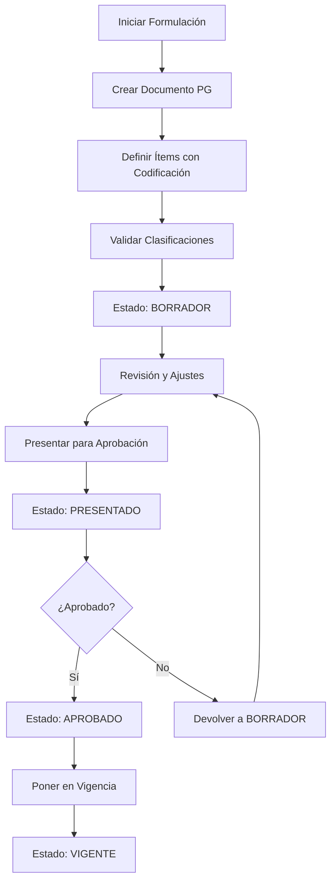
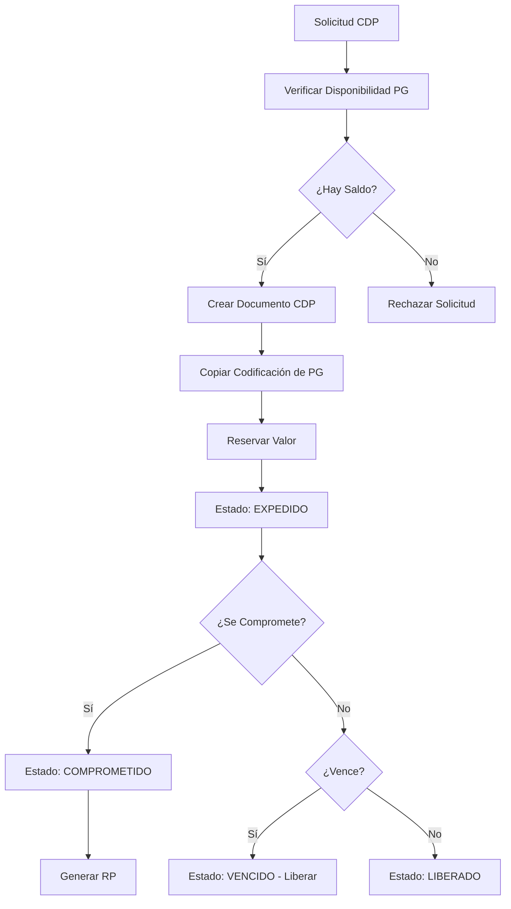
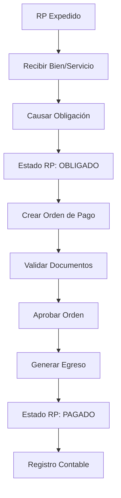

# Documentación del Módulo de Presupuesto

## Descripción General

El Módulo de Presupuesto es el núcleo central del sistema SIIAFE, responsable de gestionar todo el ciclo de vida presupuestario de las entidades gubernamentales colombianas. Este módulo maneja desde la formulación inicial del presupuesto hasta la ejecución y control de los recursos públicos, garantizando el cumplimiento de las normativas colombianas y la transparencia en el manejo de los fondos públicos.

El sistema está diseñado alrededor del concepto de **Documentos Presupuestales** y **Movimientos**, los cuales representan la dinámica del flujo presupuestario en las entidades públicas.

## Conceptos Fundamentales

### Documentos Presupuestales
Los documentos presupuestales son los instrumentos centrales que representan diferentes estados y operaciones dentro del ciclo presupuestario. Cada documento tiene un propósito específico y sigue un flujo definido según la normatividad colombiana.

### Movimientos Presupuestales
Los movimientos son las transacciones que afectan los documentos presupuestales, permitiendo modificar sus valores disponibles a través de aumentos, reducciones, traslados y otras operaciones autorizadas.

### Ítems de Documento
Cada documento presupuestal se descompone en ítems que representan las clasificaciones específicas del gasto o ingreso, donde cada ítem debe estar codificado según los tipos de código configurados en el sistema.

## Tipos de Documentos Presupuestales

### 1. Presupuesto de Gasto
**Propósito**: Documento principal que establece las apropiaciones presupuestales anuales para cada rubro de gasto.

**Características**:
- Es el documento base del cual se derivan todos los demás
- Establece los techos máximos de gasto por rubro
- Se aprueba mediante acto administrativo (Decreto, Acuerdo, etc.)
- Puede ser modificado mediante adiciones, reducciones y traslados

**Flujo Típico**:
```
Formulación → Presentación → Aprobación → Ejecución → Control
```

### 2. Certificado de Disponibilidad Presupuestal (CDP)
**Propósito**: Documento que certifica la existencia de apropiación presupuestal disponible para comprometer recursos.

**Características**:
- Es requisito previo para iniciar procesos de contratación
- Reserva recursos del presupuesto de gasto
- Tiene vigencia temporal definida
- Puede ser liberado si no se ejecuta

**Flujo Típico**:
```
Solicitud → Verificación Disponibilidad → Expedición → Compromiso/Liberación
```

### 3. Registro Presupuestal (RP)
**Propósito**: Documento que formaliza el compromiso de recursos presupuestales para una obligación específica.

**Características**:
- Se genera después de adjudicar un contrato o autorizar un gasto
- Compromete definitivamente los recursos
- Base para generar las órdenes de pago
- Requiere CDP previo

**Flujo Típico**:
```
CDP → Adjudicación/Autorización → Expedición RP → Obligación
```

### 4. Orden de Pago
**Propósito**: Documento que autoriza el pago de una obligación contraída y reconocida.

**Características**:
- Se genera a partir de un registro presupuestal
- Incluye la documentación soporte de la obligación
- Requiere aprobación de supervisor y ordenador del gasto
- Base para el egreso efectivo

**Flujo Típico**:
```
RP → Causación Obligación → Expedición Orden → Pago
```

### 5. Egreso
**Propósito**: Documento que registra la salida efectiva de recursos del tesoro público.

**Características**:
- Representa el pago real de la obligación
- Se relaciona con movimientos bancarios
- Cierra el ciclo presupuestario del gasto
- Base para la contabilización final

**Flujo Típico**:
```
Orden de Pago → Autorización → Egreso → Registro Contable
```

## Modelo de Datos

### Diagrama de Relación de Entidades

```
┌─────────────────┐    ┌─────────────────┐    ┌─────────────────┐
│ TIPO_DOCUMENTO  │    │   DOCUMENTO_    │    │   ITEM_         │
│                 │    │  PRESUPUESTAL   │    │  DOCUMENTO      │
│ • id            │◄───┤                 ├───►│                 │
│ • codigo        │    │ • id            │    │ • id            │
│ • nombre        │    │ • tipo_doc_id   │    │ • documento_id  │
│ • descripcion   │    │ • numero        │    │ • numero_item   │
│ • flujo_estado  │    │ • fecha         │    │ • descripcion   │
│ • es_activo     │    │ • estado        │    │ • valor_inicial │
│ • created_at    │    │ • valor_total   │    │ • valor_actual  │
│ • updated_at    │    │ • valor_actual  │    │ • es_activo     │
└─────────────────┘    │ • observaciones │    │ • created_at    │
          │            │ • usuario_id    │    │ • updated_at    │
          │            │ • es_activo     │    └─────────┬───────┘
          │            │ • created_at    │              │
          │            │ • updated_at    │              │
          │            └─────────┬───────┘              │
          │                      │                      │
          ▼                      │                      ▼
┌─────────────────┐              │            ┌─────────────────┐
│ CONFIG_CODIGO_  │              │            │ CODIFICACION_   │
│  TIPO_DOCUMENTO │              │            │     ITEM        │
│                 │              │            │                 │
│ • id            │              │            │ • id            │
│ • tipo_doc_id   │              │            │ • item_id       │
│ • tipo_codigo_id│              │            │ • tipo_codigo_id│
│ • es_obligatorio│              │            │ • codigo_id     │
│ • orden_captura │              │            │ • created_at    │
│ • es_activo     │              │            │ • updated_at    │
│ • created_at    │              │            └─────────────────┘
│ • updated_at    │              │
└─────────────────┘              │
                                 ▼
                       ┌─────────────────┐
                       │   MOVIMIENTO    │◄┐
                       │                 │ │
                       │ • id            │ │
                       │ • documento_    │ │
                       │   origen_id     │ │
                       │ • documento_    │ │
                       │   destino_id    │ │
                       │ • tipo_movimiento│ │
                       │ • valor         │ │
                       │ • descripcion   │ │
                       │ • fecha         │ │
                       │ • usuario_id    │ │
                       │ • es_activo     │ │
                       │ • created_at    │ │
                       │ • updated_at    │ │
                       └─────────────────┘ │
                                 │         │
                                 │         │
                                 ▼         │
                       ┌─────────────────┐ │
                       │ DETALLE_MOV_    │ │
                       │    ITEM         │ │
                       │                 │ │
                       │ • id            │ │
                       │ • movimiento_id ├─┘
                       │ • item_origen_id│
                       │ • item_destino_id│
                       │ • valor         │
                       │ • created_at    │
                       │ • updated_at    │
                       └─────────────────┘
```

### Definiciones de Tablas

#### 1. TIPO_DOCUMENTO_PRESUPUESTAL
Define los diferentes tipos de documentos presupuestales que puede manejar el sistema.

| Columna | Tipo | Descripción |
|---------|------|-------------|
| id | UUID/INT | Llave primaria |
| codigo | VARCHAR(20) | Código único del tipo (PG, CDP, RP, OP, EG) |
| nombre | VARCHAR(255) | Nombre del tipo de documento |
| descripcion | TEXT | Descripción detallada del propósito y uso |
| flujo_estados | JSON | Definición de estados y transiciones válidas |
| configuracion_numeracion | JSON | Reglas para la numeración automática |
| es_activo | BOOLEAN | Estado activo |
| creado_en | TIMESTAMP | Marca de tiempo de creación |
| actualizado_en | TIMESTAMP | Marca de tiempo de última actualización |

**Ejemplos de Registros**:
```sql
INSERT INTO tipo_documento_presupuestal VALUES 
(1, 'PG', 'Presupuesto de Gasto', 'Documento base que establece las apropiaciones anuales', 
 '{"estados": ["BORRADOR", "PRESENTADO", "APROBADO", "VIGENTE"], "flujo": {"BORRADOR": ["PRESENTADO"], "PRESENTADO": ["APROBADO", "BORRADOR"], "APROBADO": ["VIGENTE"]}}',
 '{"prefijo": "PG", "longitud": 8, "secuencial": true}', true),
(2, 'CDP', 'Certificado de Disponibilidad Presupuestal', 'Certifica existencia de apropiación disponible',
 '{"estados": ["EXPEDIDO", "COMPROMETIDO", "LIBERADO", "VENCIDO"], "flujo": {"EXPEDIDO": ["COMPROMETIDO", "LIBERADO", "VENCIDO"], "COMPROMETIDO": ["LIBERADO"]}}',
 '{"prefijo": "CDP", "longitud": 10, "secuencial": true}', true),
(3, 'RP', 'Registro Presupuestal', 'Formaliza el compromiso de recursos presupuestales',
 '{"estados": ["EXPEDIDO", "OBLIGADO", "PAGADO", "ANULADO"], "flujo": {"EXPEDIDO": ["OBLIGADO", "ANULADO"], "OBLIGADO": ["PAGADO"]}}',
 '{"prefijo": "RP", "longitud": 10, "secuencial": true}', true);
```

#### 2. CONFIGURACION_CODIGO_TIPO_DOCUMENTO
Define qué tipos de código deben aplicarse a cada tipo de documento presupuestal.

| Columna | Tipo | Descripción |
|---------|------|-------------|
| id | UUID/INT | Llave primaria |
| tipo_documento_id | UUID/INT | Llave foránea hacia tipo_documento_presupuestal |
| tipo_codigo_id | UUID/INT | Llave foránea hacia tipo_codigo (del módulo de configuración) |
| es_obligatorio | BOOLEAN | Si la codificación es obligatoria |
| orden_captura | INT | Orden de aparición en formularios de captura |
| validaciones_adicionales | JSON | Reglas de validación específicas |
| es_activo | BOOLEAN | Estado activo |
| creado_en | TIMESTAMP | Marca de tiempo de creación |
| actualizado_en | TIMESTAMP | Marca de tiempo de última actualización |

**Ejemplos de Registros**:
```sql
INSERT INTO configuracion_codigo_tipo_documento VALUES 
-- Para Presupuesto de Gasto se requieren estos códigos:
(1, 1, 1, true, 1, '{"validar_jerarquia": true}', true),  -- Rubro Presupuestal (obligatorio)
(2, 1, 2, true, 2, '{"solo_vigentes": true}', true),      -- Fuente de Financiación (obligatorio)
(3, 1, 3, true, 3, '{"validar_clasificacion": true}', true), -- Tipo de Partida (obligatorio)
-- Para CDP se requieren los mismos códigos del PG que afecta:
(4, 2, 1, true, 1, '{"heredar_de_pg": true}', true),      -- Rubro Presupuestal
(5, 2, 2, true, 2, '{"heredar_de_pg": true}', true),      -- Fuente de Financiación
(6, 2, 3, true, 3, '{"heredar_de_pg": true}', true);      -- Tipo de Partida
```

#### 3. DOCUMENTO_PRESUPUESTAL
Almacena la información principal de cada documento presupuestal.

| Columna | Tipo | Descripción |
|---------|------|-------------|
| id | UUID/INT | Llave primaria |
| tipo_documento_id | UUID/INT | Llave foránea hacia tipo_documento_presupuestal |
| numero_documento | VARCHAR(50) | Número único del documento |
| fecha_documento | DATE | Fecha de expedición del documento |
| fecha_vencimiento | DATE | Fecha de vencimiento (si aplica) |
| estado_actual | VARCHAR(50) | Estado actual del documento |
| valor_total_inicial | DECIMAL(18,2) | Valor total inicial del documento |
| valor_total_actual | DECIMAL(18,2) | Valor total actual (después de movimientos) |
| observaciones | TEXT | Observaciones generales del documento |
| documento_origen_id | UUID/INT | Documento del cual se origina (si aplica) |
| usuario_creacion_id | UUID/INT | Usuario que creó el documento |
| usuario_aprobacion_id | UUID/INT | Usuario que aprobó el documento |
| fecha_aprobacion | TIMESTAMP | Fecha de aprobación |
| metadatos | JSON | Información adicional específica del tipo |
| es_activo | BOOLEAN | Estado activo |
| creado_en | TIMESTAMP | Marca de tiempo de creación |
| actualizado_en | TIMESTAMP | Marca de tiempo de última actualización |

#### 4. ITEM_DOCUMENTO_PRESUPUESTAL
Almacena los ítems individuales que componen cada documento presupuestal.

| Columna | Tipo | Descripción |
|---------|------|-------------|
| id | UUID/INT | Llave primaria |
| documento_id | UUID/INT | Llave foránea hacia documento_presupuestal |
| numero_item | INT | Número secuencial del ítem dentro del documento |
| descripcion_item | VARCHAR(500) | Descripción del ítem |
| valor_inicial | DECIMAL(18,2) | Valor inicial del ítem |
| valor_actual | DECIMAL(18,2) | Valor actual del ítem (después de movimientos) |
| item_origen_id | UUID/INT | Ítem del cual se origina (para referencias) |
| metadatos_item | JSON | Información adicional del ítem |
| es_activo | BOOLEAN | Estado activo |
| creado_en | TIMESTAMP | Marca de tiempo de creación |
| actualizado_en | TIMESTAMP | Marca de tiempo de última actualización |

#### 5. CODIFICACION_ITEM_PRESUPUESTAL
Almacena las codificaciones aplicadas a cada ítem según la configuración del tipo de documento.

| Columna | Tipo | Descripción |
|---------|------|-------------|
| id | UUID/INT | Llave primaria |
| item_id | UUID/INT | Llave foránea hacia item_documento_presupuestal |
| tipo_codigo_id | UUID/INT | Llave foránea hacia tipo_codigo |
| codigo_id | UUID/INT | Llave foránea hacia codigo |
| creado_en | TIMESTAMP | Marca de tiempo de creación |
| actualizado_en | TIMESTAMP | Marca de tiempo de última actualización |

#### 6. MOVIMIENTO_PRESUPUESTAL
Registra todos los movimientos que afectan los documentos presupuestales.

| Columna | Tipo | Descripción |
|---------|------|-------------|
| id | UUID/INT | Llave primaria |
| numero_movimiento | VARCHAR(50) | Número único del movimiento |
| tipo_movimiento | VARCHAR(50) | Tipo de movimiento (ADICION, REDUCCION, TRASLADO, etc.) |
| documento_origen_id | UUID/INT | Documento que se ve afectado (reduce valor) |
| documento_destino_id | UUID/INT | Documento beneficiario (aumenta valor) |
| valor_total_movimiento | DECIMAL(18,2) | Valor total del movimiento |
| fecha_movimiento | DATE | Fecha del movimiento |
| descripcion_movimiento | TEXT | Descripción del motivo del movimiento |
| documento_soporte | VARCHAR(255) | Referencia del documento soporte |
| usuario_autoriza_id | UUID/INT | Usuario que autoriza el movimiento |
| fecha_autorizacion | TIMESTAMP | Fecha de autorización |
| estado_movimiento | VARCHAR(50) | Estado del movimiento |
| es_activo | BOOLEAN | Estado activo |
| creado_en | TIMESTAMP | Marca de tiempo de creación |
| actualizado_en | TIMESTAMP | Marca de tiempo de última actualización |

#### 7. DETALLE_MOVIMIENTO_ITEM
Detalla cómo se distribuye cada movimiento entre los ítems específicos.

| Columna | Tipo | Descripción |
|---------|------|-------------|
| id | UUID/INT | Llave primaria |
| movimiento_id | UUID/INT | Llave foránea hacia movimiento_presupuestal |
| item_origen_id | UUID/INT | Ítem origen del movimiento |
| item_destino_id | UUID/INT | Ítem destino del movimiento |
| valor_movimiento_item | DECIMAL(18,2) | Valor del movimiento para este ítem |
| descripcion_detalle | VARCHAR(500) | Descripción específica del detalle |
| creado_en | TIMESTAMP | Marca de tiempo de creación |
| actualizado_en | TIMESTAMP | Marca de tiempo de última actualización |

## Flujos de Procesos Presupuestales

### Flujo 1: Formulación y Aprobación del Presupuesto



### Flujo 2: Expedición de CDP



### Flujo 3: Proceso de Pago



## Tipos de Movimientos Presupuestales

### 1. Adiciones Presupuestales
**Descripción**: Incrementan el valor total del presupuesto con nuevos recursos.
**Efecto**: Aumenta el valor disponible del documento destino.
**Ejemplo**: Adición por mayores ingresos, recursos de crédito, etc.

### 2. Reducciones Presupuestales
**Descripción**: Disminuyen el valor total del presupuesto.
**Efecto**: Reduce el valor disponible del documento origen.
**Ejemplo**: Reducción por menores ingresos, ajustes fiscales, etc.

### 3. Traslados Presupuestales
**Descripción**: Mueven recursos entre diferentes rubros sin cambiar el total.
**Efecto**: Reduce el origen y aumenta el destino por el mismo valor.
**Ejemplo**: Traslado entre rubros de funcionamiento e inversión.

### 4. Suspensiones Temporales
**Descripción**: Congelan temporalmente la disponibilidad de recursos.
**Efecto**: Reduce temporalmente la disponibilidad sin eliminar la apropiación.

### 5. Liberaciones
**Descripción**: Liberan recursos previamente comprometidos.
**Efecto**: Aumenta la disponibilidad del documento origen.
**Ejemplo**: Liberación de CDP no ejecutados, anulación de RP.

## Reglas de Negocio

### Validaciones de Creación de Documentos

1. **Unicidad de Numeración**: Cada tipo de documento debe tener numeración única
2. **Codificación Obligatoria**: Todos los códigos marcados como obligatorios deben estar presentes
3. **Coherencia de Clasificaciones**: Las relaciones entre códigos deben ser válidas
4. **Disponibilidad Presupuestal**: Los CDP y RP deben tener saldo disponible en el PG origen

### Validaciones de Movimientos

1. **Saldo Suficiente**: El documento origen debe tener saldo suficiente
2. **Compatibilidad de Códigos**: Los códigos entre origen y destino deben ser compatibles
3. **Autorización Requerida**: Los movimientos deben estar autorizados por usuario competente
4. **Trazabilidad**: Debe mantenerse la cadena de origen de todos los movimientos

### Estados y Transiciones

1. **Estados Válidos**: Solo se permiten transiciones definidas en la configuración
2. **Reversibilidad**: Algunos estados permiten reversión, otros son definitivos
3. **Dependencias**: Ciertos documentos no pueden cambiar de estado si tienen dependientes activos

## Casos de Uso Específicos

### Caso 1: Formulación de Presupuesto de Inversión

**Contexto**: Entidad territorial formula su presupuesto de inversión para la vigencia 2025.

**Proceso**:
1. Crear documento PG tipo "Presupuesto de Inversión"
2. Para cada proyecto definir ítems con:
   - Rubro presupuestal (obligatorio)
   - Sector de inversión (obligatorio)
   - Programa de inversión (obligatorio)
   - Proyecto MGA (obligatorio)
   - Fuente de financiación (obligatorio)
3. Validar que las relaciones entre códigos sean coherentes
4. Aprobar el presupuesto y ponerlo en vigencia

### Caso 2: Proceso de Contratación con CDP y RP

**Contexto**: Contratación de servicios de consultoría por $100,000,000.

**Proceso**:
1. Solicitar CDP por $100,000,000
2. Sistema verifica disponibilidad en PG
3. Expedir CDP con la misma codificación del rubro afectado
4. Realizar proceso de selección del contratista
5. Al adjudicar, crear RP por el valor del contrato
6. RP hereda la codificación del CDP
7. CDP pasa a estado COMPROMETIDO
8. Al recibir los servicios, causar la obligación
9. Generar orden de pago y posteriormente el egreso

### Caso 3: Traslado Presupuestal

**Contexto**: Necesidad de trasladar $50,000,000 entre rubros de funcionamiento.

**Proceso**:
1. Identificar rubro origen con saldo suficiente
2. Crear movimiento tipo TRASLADO
3. Especificar ítems origen y destino con sus respectivos valores
4. Validar compatibilidad de codificaciones
5. Autorizar el movimiento
6. Actualizar automáticamente los saldos de ambos rubros

## Integración con Otros Módulos

### Módulo de Configuración
- **Utiliza**: Estructura de códigos para clasificar documentos e ítems
- **Depende**: Configuraciones de ámbitos, tipos de código y relaciones
- **Valida**: Coherencia de codificaciones según reglas definidas

### Módulo de Contratación (Futuro)
- **Provee**: CDP como requisito para procesos de selección
- **Recibe**: Información de adjudicaciones para generar RP
- **Sincroniza**: Estados de documentos con etapas contractuales

### Módulo de Tesorería (Futuro)
- **Provee**: Órdenes de pago para gestión del flujo de caja
- **Recibe**: Confirmación de pagos para actualizar estados
- **Sincroniza**: Egresos con movimientos bancarios

### Módulo de Contabilidad (Futuro)
- **Provee**: Información para registros contables
- **Sincroniza**: Documentos presupuestales con asientos contables
- **Valida**: Coherencia entre ejecución presupuestal y contable

## Consideraciones de Implementación

### Base de Datos

**Índices Críticos**:
```sql
-- Índices para consultas de disponibilidad
CREATE INDEX idx_documento_tipo_estado ON documento_presupuestal(tipo_documento_id, estado_actual);
CREATE INDEX idx_item_documento_valor ON item_documento_presupuestal(documento_id, valor_actual);

-- Índices para trazabilidad
CREATE INDEX idx_movimiento_documentos ON movimiento_presupuestal(documento_origen_id, documento_destino_id);
CREATE INDEX idx_detalle_movimiento ON detalle_movimiento_item(movimiento_id, item_origen_id);

-- Índices para codificación
CREATE INDEX idx_codificacion_item ON codificacion_item_presupuestal(item_id, tipo_codigo_id);
```

**Triggers de Auditoría**:
```sql
-- Trigger para mantener histórico de cambios en valores
CREATE TRIGGER trg_audit_documento_valores 
AFTER UPDATE ON documento_presupuestal
FOR EACH ROW EXECUTE FUNCTION fn_audit_documento_changes();
```

### API Design

**Endpoints RESTful**:
```typescript
// Gestión de documentos
GET /api/budget/documents/:type/:status
POST /api/budget/documents
PUT /api/budget/documents/:id
DELETE /api/budget/documents/:id

// Gestión de ítems
GET /api/budget/documents/:docId/items
POST /api/budget/documents/:docId/items
PUT /api/budget/items/:id

// Movimientos
POST /api/budget/movements
GET /api/budget/movements/:docId
PUT /api/budget/movements/:id/approve

// Consultas de disponibilidad
GET /api/budget/availability/:codes
POST /api/budget/availability/validate
```

### Validaciones en Tiempo Real

**Validación de Disponibilidad**:
```typescript
interface AvailabilityCheck {
  codigoRubro: string;
  fuenteFinanciacion: string;
  valorSolicitud: number;
  fechaVigencia: Date;
}

interface AvailabilityResponse {
  disponible: boolean;
  saldoActual: number;
  saldoComprometido: number;
  saldoDisponible: number;
  restricciones?: string[];
}
```

**Validación de Codificaciones**:
```typescript
interface CodificationValidation {
  tipoDocumento: string;
  codificaciones: {
    tipoCodigoId: string;
    codigoId: string;
  }[];
}

interface ValidationResult {
  valido: boolean;
  errores: ValidationError[];
  advertencias: ValidationWarning[];
}
```

## Reportes y Consultas Estándar

### 1. Ejecución Presupuestal
**Descripción**: Estado de ejecución por rubro, sector, programa, etc.
**Campos**: Apropiación, CDP, RP, Pagos, Saldo por Comprometer, Saldo por Obligar

### 2. Disponibilidad Presupuestal
**Descripción**: Consulta en tiempo real de disponibilidades por clasificación
**Filtros**: Por rubro, sector, fuente, período

### 3. Trazabilidad de Documentos
**Descripción**: Seguimiento completo del flujo de un documento específico
**Incluye**: Documento origen, movimientos aplicados, documentos derivados

### 4. Movimientos Presupuestales
**Descripción**: Histórico de todos los movimientos por período
**Agrupaciones**: Por tipo de movimiento, usuario, fecha

## Cumplimiento Normativo Colombiano

### Estatuto Orgánico de Presupuesto
- **Artículo 70**: Certificado de Disponibilidad Presupuestal
- **Artículo 71**: Registro Presupuestal
- **Artículo 72**: Constitución de reservas presupuestales

### Decreto 1068 de 2015
- **Capítulo 2**: Ejecución del presupuesto
- **Capítulo 3**: Modificaciones presupuestales

### Contaduría General de la Nación
- **Resolución 533 de 2015**: Marco normativo contable
- **Manual de Procedimientos**: Ejecución presupuestal

## Mejoras Futuras

### Fase 1 (Corto Plazo)
1. **Workflow Engine**: Motor de aprobaciones configurable
2. **Notificaciones**: Alertas automáticas por vencimientos y estados
3. **Dashboard**: Indicadores en tiempo real de ejecución presupuestal

### Fase 2 (Mediano Plazo)
1. **Análisis Predictivo**: Proyecciones de ejecución basadas en históricos
2. **Integración Bancaria**: Conexión directa con entidades financieras
3. **Firma Digital**: Integración con plataformas de firma electrónica

### Fase 3 (Largo Plazo)
1. **Inteligencia Artificial**: Detección de patrones anómalos en ejecución
2. **Blockchain**: Trazabilidad inmutable de transacciones críticas
3. **API Gateway**: Integración con sistemas externos (SECOP, SIIF, etc.)

### Módulos de Análisis
1. **Business Intelligence**: Cubos OLAP para análisis multidimensional
2. **Reportería Avanzada**: Generador de reportes personalizables
3. **Auditoría Continua**: Monitoreo automático de cumplimiento normativo
