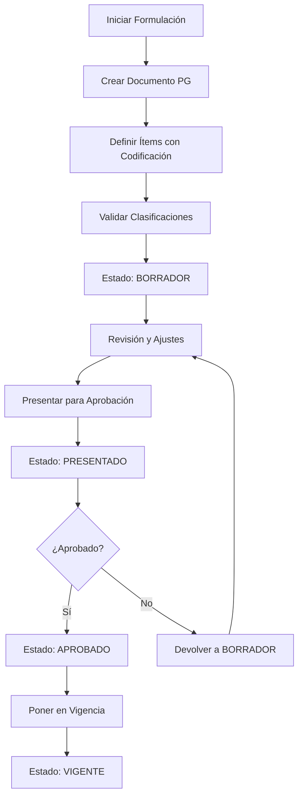
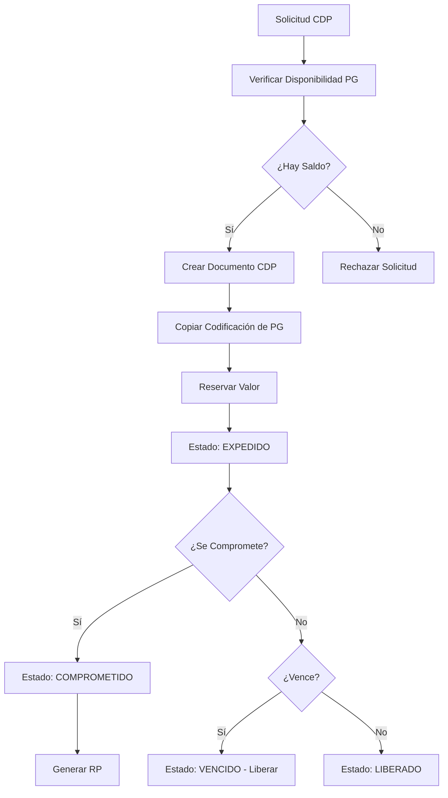
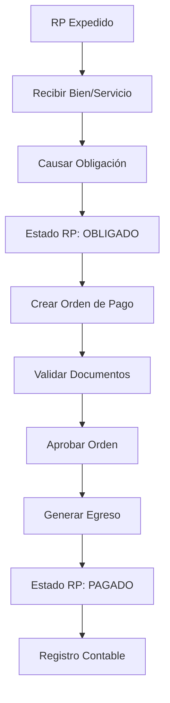

# Documentación del Módulo de Presupuesto

## Descripción General

El Módulo de Presupuesto es el núcleo central del sistema SIIAFE, responsable de gestionar todo el ciclo de vida presupuestario de las entidades gubernamentales colombianas. Este módulo maneja desde la formulación inicial del presupuesto hasta la ejecución y control de los recursos públicos, garantizando el cumplimiento de las normativas colombianas y la transparencia en el manejo de los fondos públicos.

El sistema está diseñado alrededor del concepto de **Documentos Presupuestales** y **Movimientos**, los cuales representan la dinámica del flujo presupuestario en las entidades públicas.

## Conceptos Fundamentales

### Documentos Presupuestales
Los documentos presupuestales son los instrumentos centrales que representan diferentes estados y operaciones dentro del ciclo presupuestario. Cada documento tiene un propósito específico y sigue un flujo definido según la normatividad colombiana.

### Movimientos Presupuestales
Los movimientos son las transacciones que afectan los documentos presupuestales, permitiendo modificar sus valores disponibles a través de aumentos, reducciones, traslados y otras operaciones autorizadas.

### Ítems de Documento
Cada documento presupuestal se descompone en ítems que representan las clasificaciones específicas del gasto o ingreso, donde cada ítem debe estar codificado según los tipos de código configurados en el sistema.

## Tipos de Documentos Presupuestales

### 1. Presupuesto de Gasto
**Propósito**: Documento principal que establece las apropiaciones presupuestales anuales para cada rubro de gasto.

**Características**:
- Es el documento base del cual se derivan todos los demás
- Establece los techos máximos de gasto por rubro
- Se aprueba mediante acto administrativo (Decreto, Acuerdo, etc.)
- Puede ser modificado mediante adiciones, reducciones y traslados

**Flujo Típico**:
```
Formulación → Presentación → Aprobación → Ejecución → Control
```

### 2. Certificado de Disponibilidad Presupuestal (CDP)
**Propósito**: Documento que certifica la existencia de apropiación presupuestal disponible para comprometer recursos.

**Características**:
- Es requisito previo para iniciar procesos de contratación
- Reserva recursos del presupuesto de gasto
- Tiene vigencia temporal definida
- Puede ser liberado si no se ejecuta

**Flujo Típico**:
```
Solicitud → Verificación Disponibilidad → Expedición → Compromiso/Liberación
```

### 3. Registro Presupuestal (RP)
**Propósito**: Documento que formaliza el compromiso de recursos presupuestales para una obligación específica.

**Características**:
- Se genera después de adjudicar un contrato o autorizar un gasto
- Compromete definitivamente los recursos
- Base para generar las órdenes de pago
- Requiere CDP previo

**Flujo Típico**:
```
CDP → Adjudicación/Autorización → Expedición RP → Obligación
```

### 4. Orden de Pago
**Propósito**: Documento que autoriza el pago de una obligación contraída y reconocida.

**Características**:
- Se genera a partir de un registro presupuestal
- Incluye la documentación soporte de la obligación
- Requiere aprobación de supervisor y ordenador del gasto
- Base para el egreso efectivo

**Flujo Típico**:
```
RP → Causación Obligación → Expedición Orden → Pago
```

### 5. Egreso
**Propósito**: Documento que registra la salida efectiva de recursos del tesoro público.

**Características**:
- Representa el pago real de la obligación
- Se relaciona con movimientos bancarios
- Cierra el ciclo presupuestario del gasto
- Base para la contabilización final

**Flujo Típico**:
```
Orden de Pago → Autorización → Egreso → Registro Contable
```

### 6. Liberación CDP
**Propósito**: Documento que formaliza la devolución de recursos no utilizados de un Certificado de Disponibilidad Presupuestal.

**Características**:
- Se genera como documento independiente con número único
- Libera recursos comprometidos en un CDP que no se van a ejecutar
- Restaura automáticamente la disponibilidad en el Presupuesto de Gasto
- Mejora la trazabilidad de liberaciones parciales o totales
- Permite auditoría completa de decisiones administrativas

**Flujo Típico**:
```
CDP → Análisis de Ejecución → Expedición Liberación → Restauración PG
```

**Nuevo Modelo de Afectación**:
```
MOV-XXX: Expedición Liberación CDP
├── Línea 1: +$Valor → Liberación CDP (documento nuevo)
└── Línea 2: -$Valor → CDP (contrapartida automática)

MOV-XXX-B: Restauración automática al PG
├── Línea 1: +$Valor → PG (restauración disponibilidad)
```

### 7. Liquidación RP
**Propósito**: Documento que formaliza la liquidación y cierre de un Registro Presupuestal con devolución de saldos no ejecutados.

**Características**:
- Se genera como documento independiente con número único
- Liquida saldos no ejecutados de un RP finalizado
- Restaura automáticamente la disponibilidad en el CDP origen
- Permite liquidaciones parciales por fases de contrato
- Genera cuenta por pagar si corresponde a liquidación definitiva

**Flujo Típico**:
```
RP → Finalización/Liquidación → Expedición Liquidación → Restauración CDP
```

**Nuevo Modelo de Afectación**:
```
MOV-XXX: Expedición Liquidación RP
├── Línea 1: +$Valor → Liquidación RP (documento nuevo)
└── Línea 2: -$Valor → RP (contrapartida automática)

MOV-XXX-B: Restauración automática al CDP
├── Línea 1: +$Valor → CDP (restauración disponibilidad)
```

### Ventajas del Nuevo Modelo de Liberaciones y Liquidaciones

**1. Trazabilidad Completa**
- Cada liberación y liquidación tiene documento propio
- Numeración única y consecutiva
- Historial completo de decisiones administrativas

**2. Separación de Responsabilidades**
- Creación del documento: Decisión administrativa
- Afectación presupuestal: Impacto automático
- Restauración: Devolución automática de recursos

**3. Flexibilidad Operativa**
- Liberaciones parciales de un mismo CDP
- Liquidaciones escalonadas por fases
- Cancelaciones con trazabilidad completa

**4. Integridad Automática**
- Contrapartidas automáticas garantizan balance
- Validaciones automáticas de valores y estados
- Conciliación automática entre documentos

**5. Beneficios Contables**
- Mejor representación en estados financieros
- Cuentas por cobrar/pagar claramente identificadas
- Auditoría mejorada de operaciones presupuestales

## Modelo de Datos

### Diagrama de Relación de Entidades

```
┌─────────────────┐    ┌─────────────────┐    ┌─────────────────┐
│ TIPO_DOCUMENTO  │    │   DOCUMENTO_    │    │   ITEM_         │
│                 │    │  PRESUPUESTAL   │    │  DOCUMENTO      │
│ • id            │◄───┤                 ├───►│                 │
│ • codigo        │    │ • id            │    │ • id            │
│ • nombre        │    │ • tipo_doc_id   │    │ • documento_id  │
│ • descripcion   │    │ • numero        │    │ • numero_item   │
│ • flujo_estado  │    │ • fecha         │    │ • descripcion   │
│ • es_activo     │    │ • estado        │    │ • valor_inicial │
│ • created_at    │    │ • valor_total   │    │ • valor_actual  │
│ • updated_at    │    │ • valor_actual  │    │ • es_activo     │
└─────────────────┘    │ • observaciones │    │ • created_at    │
          │            │ • usuario_id    │    │ • updated_at    │
          │            │ • es_activo     │    └─────────┬───────┘
          │            │ • created_at    │              │
          │            │ • updated_at    │              │
          │            └─────────┬───────┘              │
          │                      │                      │
          ▼                      │                      ▼
┌─────────────────┐              │            ┌─────────────────┐
│ CONFIG_CODIGO_  │              │            │ CODIFICACION_   │
│  TIPO_DOCUMENTO │              │            │     ITEM        │
│                 │              │            │                 │
│ • id            │              │            │ • id            │
│ • tipo_doc_id   │              │            │ • item_id       │
│ • tipo_codigo_id│              │            │ • tipo_codigo_id│
│ • es_obligatorio│              │            │ • codigo_id     │
│ • orden_captura │              │            │ • created_at    │
│ • es_activo     │              │            │ • updated_at    │
│ • created_at    │              │            └─────────────────┘
│ • updated_at    │              │
└─────────┬───────┘              │
          │                      │
          ▼                      │
┌─────────────────┐              │
│ DOCUMENTO_TIPO_ │              │
│   PRECEDENTE    │              │
│                 │              │
│ • id            │              │
│ • tipo_doc_id   │              │
│ • tipo_prec_id  │              │
│ • es_obligatorio│              │
│ • orden_prec    │              │
│ • descripcion   │              │
│ • es_activo     │              │
│ • created_at    │              │
│ • updated_at    │              │
└─────────┬───────┘              │
          │                      │
          ▼                      │
┌─────────────────┐              │
│ DOC_PRECEDENTE_ │              │
│ ESTADO_REQUERIDO│              │
│                 │              │
│ • id            │              │
│ • doc_precedente│              │
│   _id           │              │
│ • estado_req    │              │
│ • descripcion   │              │
│ • es_activo     │              │
│ • created_at    │              │
│ • updated_at    │              │
└─────────────────┘              │
                                 │
                                 │
  ┌─────────────────────────────────────────────────────────────┐
  │                                                             │
  ▼                                                             ▼
┌─────────────────┐              ┌─────────────────┐    ┌─────────────────┐
│   RELACION_     │              │   MOVIMIENTO    │    │ DETALLE_MOV_    │◄┐
│  DOCUMENTO_     │              │                 │    │    ITEM         │ │
│ PRESUPUESTAL    │              │ • id            │    │                 │ │
│                 │              │ • numero_mov    │    │ • id            │ │
│ • id            │              │ • tipo_movimiento│   │ • movimiento_id ├─┘
│ • documento_    │              │ • valor_total   │    │ • item_origen_id│
│   origen_id     │              │ • fecha         │    │ • item_destino_id│
│ • documento_    │              │ • descripcion   │    │ • valor         │
│   destino_id    │              │ • usuario_id    │    │ • created_at    │
│ • tipo_relacion │              │ • estado        │    │ • updated_at    │
│ • valor_relacion│              │ • es_activo     │    └─────────────────┘
│ • porcentaje    │              │ • created_at    │              │
│ • metadatos     │              │ • updated_at    │              │
│ • es_activo     │              └─────────────────┘              │
│ • created_at    │                                               │
│ • updated_at    │                                               │
└─────────────────┘                         ┌─────────────────────┘
                                           │
                                           ▼
                                 ┌─────────────────┐
                                 │ DETALLE_MOV_    │
                                 │   DOCUMENTO     │
                                 │                 │
                                 │ • id            │
                                 │ • movimiento_id │
                                 │ • documento_    │
                                 │   origen_id     │
                                 │ • documento_    │
                                 │   destino_id    │
                                 │ • valor_documento│
                                 │ • created_at    │
                                 │ • updated_at    │
                                 └─────────────────┘
```

### Definiciones de Tablas

#### 1. TIPO_DOCUMENTO_PRESUPUESTAL
Define los diferentes tipos de documentos presupuestales que puede manejar el sistema.

| Columna | Tipo | Descripción |
|---------|------|-------------|
| id | UUID/INT | Llave primaria |
| codigo | VARCHAR(20) | Código único del tipo (PG, CDP, RP, OP, EG) |
| nombre | VARCHAR(255) | Nombre del tipo de documento |
| descripcion | TEXT | Descripción detallada del propósito y uso |
| flujo_estados | JSON | Definición de estados y transiciones válidas |
| configuracion_numeracion | JSON | Reglas para la numeración automática |
| es_activo | BOOLEAN | Estado activo |
| creado_en | TIMESTAMP | Marca de tiempo de creación |
| actualizado_en | TIMESTAMP | Marca de tiempo de última actualización |

**Ejemplos de Registros**:
```sql
INSERT INTO tipo_documento_presupuestal VALUES 
(1, 'PG', 'Presupuesto de Gasto', 'Documento base que establece las apropiaciones anuales', 
 '{"estados": ["BORRADOR", "PRESENTADO", "APROBADO", "VIGENTE"], "flujo": {"BORRADOR": ["PRESENTADO"], "PRESENTADO": ["APROBADO", "BORRADOR"], "APROBADO": ["VIGENTE"]}}',
 '{"prefijo": "PG", "longitud": 8, "secuencial": true}', true),
(2, 'CDP', 'Certificado de Disponibilidad Presupuestal', 'Certifica existencia de apropiación disponible',
 '{"estados": ["EXPEDIDO", "COMPROMETIDO", "LIBERADO", "VENCIDO"], "flujo": {"EXPEDIDO": ["COMPROMETIDO", "LIBERADO", "VENCIDO"], "COMPROMETIDO": ["LIBERADO"]}}',
 '{"prefijo": "CDP", "longitud": 10, "secuencial": true}', true),
(3, 'RP', 'Registro Presupuestal', 'Formaliza el compromiso de recursos presupuestales',
 '{"estados": ["EXPEDIDO", "OBLIGADO", "PAGADO", "ANULADO"], "flujo": {"EXPEDIDO": ["OBLIGADO", "ANULADO"], "OBLIGADO": ["PAGADO"]}}',
 '{"prefijo": "RP", "longitud": 10, "secuencial": true}', true);
```

#### 2. CONFIGURACION_CODIGO_TIPO_DOCUMENTO
Define qué tipos de código deben aplicarse a cada tipo de documento presupuestal.

| Columna | Tipo | Descripción |
|---------|------|-------------|
| id | UUID/INT | Llave primaria |
| tipo_documento_id | UUID/INT | Llave foránea hacia tipo_documento_presupuestal |
| tipo_codigo_id | UUID/INT | Llave foránea hacia tipo_codigo (del módulo de configuración) |
| es_obligatorio | BOOLEAN | Si la codificación es obligatoria |
| orden_captura | INT | Orden de aparición en formularios de captura |
| validaciones_adicionales | JSON | Reglas de validación específicas |
| es_activo | BOOLEAN | Estado activo |
| creado_en | TIMESTAMP | Marca de tiempo de creación |
| actualizado_en | TIMESTAMP | Marca de tiempo de última actualización |

**Ejemplos de Registros**:
```sql
INSERT INTO configuracion_codigo_tipo_documento VALUES 
-- Para Presupuesto de Gasto se requieren estos códigos:
(1, 1, 1, true, 1, '{"validar_jerarquia": true}', true),  -- Rubro Presupuestal (obligatorio)
(2, 1, 2, true, 2, '{"solo_vigentes": true}', true),      -- Fuente de Financiación (obligatorio)
(3, 1, 3, true, 3, '{"validar_clasificacion": true}', true), -- Tipo de Partida (obligatorio)
-- Para CDP se requieren los mismos códigos del PG que afecta:
(4, 2, 1, true, 1, '{"heredar_de_pg": true}', true),      -- Rubro Presupuestal
(5, 2, 2, true, 2, '{"heredar_de_pg": true}', true),      -- Fuente de Financiación
(6, 2, 3, true, 3, '{"heredar_de_pg": true}', true);      -- Tipo de Partida
```

#### 3. DOCUMENTO_PRESUPUESTAL
Almacena la información principal de cada documento presupuestal.

| Columna | Tipo | Descripción |
|---------|------|-------------|
| id | UUID/INT | Llave primaria |
| tipo_documento_id | UUID/INT | Llave foránea hacia tipo_documento_presupuestal |
| numero_documento | VARCHAR(50) | Número único del documento |
| fecha_documento | DATE | Fecha de expedición del documento |
| fecha_vencimiento | DATE | Fecha de vencimiento (si aplica) |
| estado_actual | VARCHAR(50) | Estado actual del documento |
| valor_total_inicial | DECIMAL(18,2) | Valor total inicial del documento |
| valor_total_actual | DECIMAL(18,2) | Valor total actual (después de movimientos) |
| observaciones | TEXT | Observaciones generales del documento |
| documento_origen_id | UUID/INT | Documento del cual se origina (si aplica) - **ELIMINADO** |
| usuario_creacion_id | UUID/INT | Usuario que creó el documento |
| usuario_aprobacion_id | UUID/INT | Usuario que aprobó el documento |
| fecha_aprobacion | TIMESTAMP | Fecha de aprobación |
| metadatos | JSON | Información adicional específica del tipo |
| es_activo | BOOLEAN | Estado activo |
| creado_en | TIMESTAMP | Marca de tiempo de creación |
| actualizado_en | TIMESTAMP | Marca de tiempo de última actualización |

#### 4. ITEM_DOCUMENTO_PRESUPUESTAL
Almacena los ítems individuales que componen cada documento presupuestal.

| Columna | Tipo | Descripción |
|---------|------|-------------|
| id | UUID/INT | Llave primaria |
| documento_id | UUID/INT | Llave foránea hacia documento_presupuestal |
| numero_item | INT | Número secuencial del ítem dentro del documento |
| descripcion_item | VARCHAR(500) | Descripción del ítem |
| valor_inicial | DECIMAL(18,2) | Valor inicial del ítem |
| valor_actual | DECIMAL(18,2) | Valor actual del ítem (después de movimientos) |
| item_origen_id | UUID/INT | Ítem del cual se origina (para referencias) |
| metadatos_item | JSON | Información adicional del ítem |
| es_activo | BOOLEAN | Estado activo |
| creado_en | TIMESTAMP | Marca de tiempo de creación |
| actualizado_en | TIMESTAMP | Marca de tiempo de última actualización |

#### 5. CODIFICACION_ITEM_PRESUPUESTAL
Almacena las codificaciones aplicadas a cada ítem según la configuración del tipo de documento.

| Columna | Tipo | Descripción |
|---------|------|-------------|
| id | UUID/INT | Llave primaria |
| item_id | UUID/INT | Llave foránea hacia item_documento_presupuestal |
| tipo_codigo_id | UUID/INT | Llave foránea hacia tipo_codigo |
| codigo_id | UUID/INT | Llave foránea hacia codigo |
| creado_en | TIMESTAMP | Marca de tiempo de creación |
| actualizado_en | TIMESTAMP | Marca de tiempo de última actualización |

#### 6. RELACION_DOCUMENTO_PRESUPUESTAL
Define las relaciones muchos-a-muchos entre documentos presupuestales. Esta tabla reemplaza el campo `documento_origen_id` para permitir que un documento pueda originarse de múltiples documentos origen.

| Columna | Tipo | Descripción |
|---------|------|-------------|
| id | UUID/INT | Llave primaria |
| documento_origen_id | UUID/INT | Llave foránea hacia documento_presupuestal (origen) |
| documento_destino_id | UUID/INT | Llave foránea hacia documento_presupuestal (destino) |
| tipo_relacion | VARCHAR(50) | Tipo de relación (INCORPORA, ORIGINA, MODIFICA, ANULA, etc.) |
| valor_relacion | DECIMAL(18,2) | Valor específico de la relación |
| porcentaje_relacion | DECIMAL(5,2) | Porcentaje de participación (si aplica) |
| metadatos_relacion | JSON | Información adicional de la relación |
| fecha_relacion | DATE | Fecha en que se establece la relación |
| es_activo | BOOLEAN | Estado activo |
| creado_en | TIMESTAMP | Marca de tiempo de creación |
| actualizado_en | TIMESTAMP | Marca de tiempo de última actualización |

**Tipos de Relación**:
- `INCORPORA`: Un documento incorpora/consolida otro(s) documento(s)
- `ORIGINA`: Un documento da origen a otro documento
- `MODIFICA`: Un documento modifica valores de otro documento
- `ANULA`: Un documento anula parcial o totalmente otro documento
- `SUSTITUYE`: Un documento sustituye completamente otro documento

**Ejemplos de Casos de Uso**:

1. **RP que incorpora múltiples CDPs**:
```sql
-- RP-001 por $100,000,000 incorpora tres CDPs diferentes
INSERT INTO relacion_documento_presupuestal VALUES 
(1, 100, 200, 'INCORPORA', 50000000.00, 50.00, '{"concepto": "Consultoría fase 1", "contrato": "CNT-001"}', '2025-03-15', true),
(2, 101, 200, 'INCORPORA', 30000000.00, 30.00, '{"concepto": "Consultoría fase 2", "contrato": "CNT-001"}', '2025-03-15', true),
(3, 102, 200, 'INCORPORA', 20000000.00, 20.00, '{"concepto": "Gastos operativos", "contrato": "CNT-001"}', '2025-03-15', true);
```

2. **OP que incorpora múltiples RPs**:
```sql
-- OP-001 para pago de múltiples obligaciones
INSERT INTO relacion_documento_presupuestal VALUES 
(4, 200, 300, 'INCORPORA', 75000000.00, 75.00, '{"obligacion": "Pago parcial contrato CNT-001"}', '2025-04-20', true),
(5, 201, 300, 'INCORPORA', 25000000.00, 25.00, '{"obligacion": "Pago servicios adicionales"}', '2025-04-20', true);
```

3. **Adición presupuestal que afecta múltiples rubros**:
```sql
-- Adición que modifica varios rubros del PG original
INSERT INTO relacion_documento_presupuestal VALUES 
(6, 1, 1, 'MODIFICA', 150000000.00, NULL, '{"tipo_modificacion": "ADICION", "acto_admin": "Decreto 001-2025"}', '2025-02-10', true),
(7, 1, 1, 'MODIFICA', 75000000.00, NULL, '{"tipo_modificacion": "ADICION", "rubro": "220101", "acto_admin": "Decreto 001-2025"}', '2025-02-10', true);
```

#### 7. DOCUMENTO_TIPO_PRECEDENTE
Define qué tipos de documentos pueden servir como precedentes para crear otros tipos de documentos. Esta tabla establece las relaciones válidas entre tipos de documentos según el flujo presupuestal.

| Columna | Tipo | Descripción |
|---------|------|-------------|
| id | UUID/INT | Llave primaria |
| tipo_documento_id | UUID/INT | Llave foránea hacia tipo_documento_presupuestal (documento destino) |
| tipo_documento_precedente_id | UUID/INT | Llave foránea hacia tipo_documento_presupuestal (documento origen/precedente) |
| es_obligatorio | BOOLEAN | Si el precedente es obligatorio para crear el documento |
| orden_precedencia | INT | Orden de precedencia cuando hay múltiples opciones |
| descripcion | TEXT | Descripción de la relación de precedencia |
| es_activo | BOOLEAN | Estado activo |
| creado_en | TIMESTAMP | Marca de tiempo de creación |
| actualizado_en | TIMESTAMP | Marca de tiempo de última actualización |

**Ejemplos de Configuración**:
```sql
INSERT INTO documento_tipo_precedente VALUES 
-- CDP debe estar precedido por PG
(1, 2, 1, true, 1, 'CDP debe originarse desde un Presupuesto de Gasto', true, NOW(), NOW()),
-- RP debe estar precedido por CDP  
(2, 3, 2, true, 1, 'RP debe originarse desde un CDP', true, NOW(), NOW()),
-- OP debe estar precedida por RP
(3, 4, 3, true, 1, 'OP debe originarse desde un RP', true, NOW(), NOW());
```

#### 8. DOCUMENTO_PRECEDENTE_ESTADO_REQUERIDO
Define qué estados específicos deben tener los documentos precedentes para poder crear un nuevo documento. Esta tabla extiende la configuración de precedentes especificando los estados válidos.

| Columna | Tipo | Descripción |
|---------|------|-------------|
| id | UUID/INT | Llave primaria |
| documento_tipo_precedente_id | UUID/INT | Llave foránea hacia documento_tipo_precedente |
| estado_requerido | VARCHAR(50) | Estado que debe tener el documento precedente |
| descripcion | TEXT | Descripción del por qué se requiere este estado |
| es_activo | BOOLEAN | Estado activo |
| creado_en | TIMESTAMP | Marca de tiempo de creación |
| actualizado_en | TIMESTAMP | Marca de tiempo de última actualización |

**Ejemplos de Configuración**:
```sql
INSERT INTO documento_precedente_estado_requerido VALUES 
-- Para crear CDP desde PG, el PG debe estar VIGENTE
(1, 1, 'VIGENTE', 'El Presupuesto de Gasto debe estar vigente para expedir CDPs', true, NOW(), NOW()),
-- Para crear RP desde CDP, el CDP puede estar EXPEDIDO o COMPROMETIDO
(2, 2, 'EXPEDIDO', 'El CDP debe estar expedido para crear un RP', true, NOW(), NOW()),
(3, 2, 'COMPROMETIDO', 'Un CDP ya comprometido puede generar RPs adicionales si tiene saldo', true, NOW(), NOW()),
-- Para crear OP desde RP, el RP debe estar EXPEDIDO u OBLIGADO
(4, 3, 'EXPEDIDO', 'El RP debe estar expedido para crear una OP', true, NOW(), NOW()),
(5, 3, 'OBLIGADO', 'Un RP obligado puede generar OPs adicionales si tiene saldo pendiente', true, NOW(), NOW());
```

### Validaciones de Precedentes y Estados

1. **Precedencia Válida**: Los documentos solo pueden crearse desde precedentes configurados como válidos
2. **Estados Requeridos**: El documento precedente debe estar en uno de los estados configurados como válidos
3. **Múltiples Estados Válidos**: Un precedente puede tener varios estados válidos para la misma operación
4. **Validación Automática**: El sistema valida automáticamente antes de permitir la creación

**Ejemplos de Validaciones**:

- **Para crear un RP**: El CDP precedente debe estar en estado "EXPEDIDO" o "COMPROMETIDO"
- **Para crear una OP**: El RP precedente debe estar en estado "EXPEDIDO" u "OBLIGADO"  
- **Para crear un Egreso**: La OP precedente debe estar en estado "EXPEDIDA"

**Mensajes de Error Configurables**:
- Si el tipo de precedente no es válido: "El documento origen (tipo X) no es un precedente válido para el tipo de documento destino (Y)"
- Si el estado no es válido: "El documento origen está en estado 'Z' pero se requiere uno de los estados válidos para esta operación"

## Flujos de Procesos Presupuestales

### Flujo 1: Formulación y Aprobación del Presupuesto



### Flujo 2: Expedición de CDP



### Flujo 3: Proceso de Pago



## Tipos de Movimientos Presupuestales

### 1. Adiciones Presupuestales
**Descripción**: Incrementan el valor total del presupuesto con nuevos recursos.
**Efecto**: Aumenta el valor disponible del documento destino.
**Ejemplo**: Adición por mayores ingresos, recursos de crédito, etc.

### 2. Reducciones Presupuestales
**Descripción**: Disminuyen el valor total del presupuesto.
**Efecto**: Reduce el valor disponible del documento origen.
**Ejemplo**: Reducción por menores ingresos, ajustes fiscales, etc.

### 3. Traslados Presupuestales
**Descripción**: Mueven recursos entre diferentes rubros sin cambiar el total.
**Efecto**: Reduce el origen y aumenta el destino por el mismo valor.
**Ejemplo**: Traslado entre rubros de funcionamiento e inversión.

### 4. Suspensiones Temporales
**Descripción**: Congelan temporalmente la disponibilidad de recursos.
**Efecto**: Reduce temporalmente la disponibilidad sin eliminar la apropiación.

### 5. Liberaciones
**Descripción**: Liberan recursos previamente comprometidos.
**Efecto**: Aumenta la disponibilidad del documento origen.
**Ejemplo**: Liberación de CDP no ejecutados, anulación de RP.

## Reglas de Negocio

### Validaciones de Creación de Documentos

1. **Unicidad de Numeración**: Cada tipo de documento debe tener numeración única
2. **Codificación Obligatoria**: Todos los códigos marcados como obligatorios deben estar presentes
3. **Coherencia de Clasificaciones**: Las relaciones entre códigos deben ser válidas
4. **Disponibilidad Presupuestal**: Los CDP y RP deben tener saldo disponible en el PG origen

### Validaciones de Movimientos

1. **Saldo Suficiente**: El documento origen debe tener saldo suficiente
2. **Compatibilidad de Códigos**: Los códigos entre origen y destino deben ser compatibles
3. **Autorización Requerida**: Los movimientos deben estar autorizados por usuario competente
4. **Trazabilidad**: Debe mantenerse la cadena de origen de todos los movimientos

### Estados y Transiciones

1. **Estados Válidos**: Solo se permiten transiciones definidas en la configuración
2. **Reversibilidad**: Algunos estados permiten reversión, otros son definitivos
3. **Dependencias**: Ciertos documentos no pueden cambiar de estado si tienen dependientes activos

## Casos de Uso Específicos

### Caso 1: Formulación de Presupuesto de Inversión

**Contexto**: Entidad territorial formula su presupuesto de inversión para la vigencia 2025.

**Proceso**:
1. Crear documento PG tipo "Presupuesto de Inversión"
2. Para cada proyecto definir ítems con:
   - Rubro presupuestal (obligatorio)
   - Sector de inversión (obligatorio)
   - Programa de inversión (obligatorio)
   - Proyecto MGA (obligatorio)
   - Fuente de financiación (obligatorio)
3. Validar que las relaciones entre códigos sean coherentes
4. Aprobar el presupuesto y ponerlo en vigencia

### Caso 2: Proceso de Contratación con CDP y RP

**Contexto**: Contratación de servicios de consultoría por $100,000,000.

**Proceso**:
1. Solicitar CDP por $100,000,000
2. Sistema verifica disponibilidad en PG
3. Expedir CDP con la misma codificación del rubro afectado
4. Realizar proceso de selección del contratista
5. Al adjudicar, crear RP por el valor del contrato
6. RP hereda la codificación del CDP
7. CDP pasa a estado COMPROMETIDO
8. Al recibir los servicios, causar la obligación
9. Generar orden de pago y posteriormente el egreso

### Caso 2.1: RP que Incorpora Múltiples CDPs

**Contexto**: Contrato de consultoría que requiere recursos de diferentes CDPs previamente expedidos.

**Escenario**:
- CDP-100: $50,000,000 (servicios fase 1)
- CDP-101: $30,000,000 (servicios fase 2)  
- CDP-102: $20,000,000 (gastos operativos)
- **Total RP**: $100,000,000

**Proceso**:
1. Verificar disponibilidad en los tres CDPs
2. Crear RP-001 por $100,000,000
3. Establecer relaciones:
   - RP-001 ← INCORPORA ← CDP-100 ($50M - 50%)
   - RP-001 ← INCORPORA ← CDP-101 ($30M - 30%)
   - RP-001 ← INCORPORA ← CDP-102 ($20M - 20%)
4. Actualizar estados:
   - CDP-100, CDP-101, CDP-102 → COMPROMETIDO
   - RP-001 → EXPEDIDO
5. Mantener trazabilidad completa de origen de recursos

**Beneficios**:
- **Flexibilidad**: Permite combinar recursos de diferentes fuentes
- **Trazabilidad**: Mantiene el origen exacto de cada peso
- **Control**: Validación de disponibilidad por cada CDP origen
- **Transparencia**: Auditoría completa de la composición del RP

### Caso 3: Traslado Presupuestal

**Contexto**: Necesidad de trasladar $50,000,000 entre rubros de funcionamiento.

**Proceso**:
1. Identificar rubro origen con saldo suficiente
2. Crear movimiento tipo TRASLADO
3. Especificar ítems origen y destino con sus respectivos valores
4. Validar compatibilidad de codificaciones
5. Autorizar el movimiento
6. Actualizar automáticamente los saldos de ambos rubros

### Caso 3.1: Orden de Pago Múltiple

**Contexto**: Pago mensual que consolida múltiples obligaciones del mismo contratista.

**Escenario**:
- RP-200: $40,000,000 (servicios enero)
- RP-201: $35,000,000 (servicios febrero)
- RP-202: $25,000,000 (servicios marzo)
- **Total OP**: $100,000,000

**Proceso**:
1. Validar que todos los RPs estén en estado OBLIGADO
2. Crear OP-300 por $100,000,000
3. Establecer relaciones:
   - OP-300 ← INCORPORA ← RP-200 ($40M - 40%)
   - OP-300 ← INCORPORA ← RP-201 ($35M - 35%)
   - OP-300 ← INCORPORA ← RP-202 ($25M - 25%)
4. Generar un solo comprobante de egreso
5. Mantener trazabilidad hacia CDPs originales

### Caso 3.2: Modificación Presupuestal Compleja

**Contexto**: Decreto de adición presupuestal que afecta múltiples sectores.

**Escenario**:
- Adición total: $500,000,000
- Distribuido en: Salud ($200M), Educación ($180M), Infraestructura ($120M)
- Fuente: Recursos del crédito internacional

**Proceso**:
1. Crear documento PG-ADD-001 por $500,000,000
2. Establecer relaciones con PG original:
   - PG-001 ← MODIFICA ← PG-ADD-001 (Sector Salud - $200M)
   - PG-001 ← MODIFICA ← PG-ADD-001 (Sector Educación - $180M)
   - PG-001 ← MODIFICA ← PG-ADD-001 (Sector Infraestructura - $120M)
3. Actualizar saldos disponibles por sector
4. Generar reportes de impacto por la modificación

### Caso 3.3: Anulación Parcial de Documentos

**Contexto**: CDP expedido por error debe ser anulado parcialmente y reemplazado.

**Escenario**:
- CDP-150 original: $80,000,000 (error en clasificación)
- Anular: $30,000,000 (rubro incorrecto)
- Crear: CDP-151 por $30,000,000 (rubro correcto)

**Proceso**:
1. Crear CDP-151 por $30,000,000 con clasificación correcta
2. Establecer relaciones:
   - CDP-150 ← ANULA ← CDP-151 ($30M parcial)
   - CDP-151 ← SUSTITUYE ← CDP-150 ($30M)
3. Actualizar saldos:
   - CDP-150: $50,000,000 (saldo activo)
   - CDP-151: $30,000,000 (nuevo)
4. Mantener auditoría de la corrección

### Caso 4: Validación de Estados en Creación de Documentos

**Contexto**: Proceso de creación de RP con validación automática de estados del CDP precedente.

**Escenario Exitoso**:
- CDP-150 expedido por $75,000,000 en estado "EXPEDIDO"
- Solicitud de RP por $40,000,000

**Proceso de Validación**:
1. **Verificar Precedencia**: Sistema confirma que CDP es precedente válido para RP
2. **Verificar Estado**: Sistema verifica que "EXPEDIDO" es un estado válido según configuración
3. **Permitir Creación**: RP-075 se crea exitosamente
4. **Actualizar Estado**: CDP-150 pasa a estado "COMPROMETIDO"

**Escenario de Error por Estado Inválido**:
- CDP-151 en estado "LIBERADO"
- Solicitud de RP por $25,000,000

**Proceso de Validación**:
1. **Verificar Precedencia**: ✓ CDP es precedente válido para RP
2. **Verificar Estado**: ✗ "LIBERADO" no es un estado válido para crear RP
3. **Rechazar Creación**: Sistema muestra error: "El documento origen está en estado 'LIBERADO' pero se requiere uno de los estados válidos (EXPEDIDO, COMPROMETIDO) para esta operación"

**Estados Válidos por Tipo de Documento**:

| Documento Destino | Precedente | Estados Válidos | Descripción |
|-------------------|------------|-----------------|-------------|
| CDP | PG | VIGENTE | PG debe estar vigente |
| RP | CDP | EXPEDIDO, COMPROMETIDO | CDP disponible para compromiso |
| OP | RP | EXPEDIDO, OBLIGADO | RP con obligaciones pendientes |
| Egreso | OP | EXPEDIDA | OP autorizada para pago |
| Liberación CDP | CDP | EXPEDIDO, COMPROMETIDO | CDP con saldo a liberar |
| Liquidación RP | RP | EXPEDIDO, OBLIGADO | RP con saldo a liquidar |

**Beneficios del Sistema de Validación**:
- **Prevención de Errores**: Evita crear documentos desde precedentes en estados incorrectos
- **Consistencia**: Garantiza que el flujo presupuestal se mantenga coherente
- **Flexibilidad**: Permite múltiples estados válidos según el contexto
- **Trazabilidad**: Mantiene registro del estado del precedente al momento de la creación
